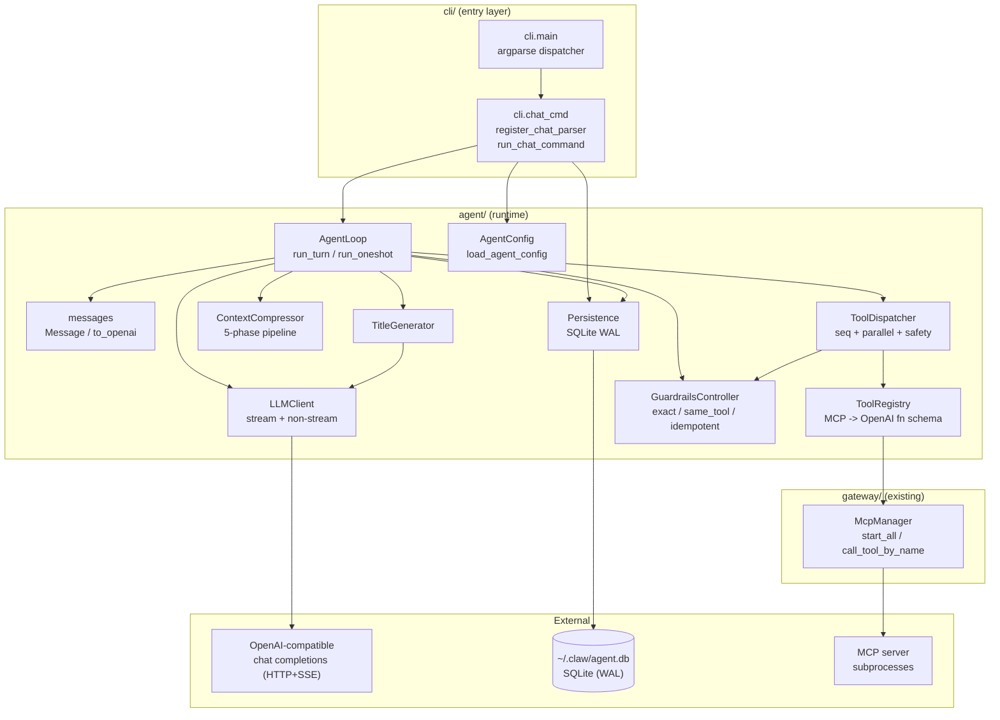
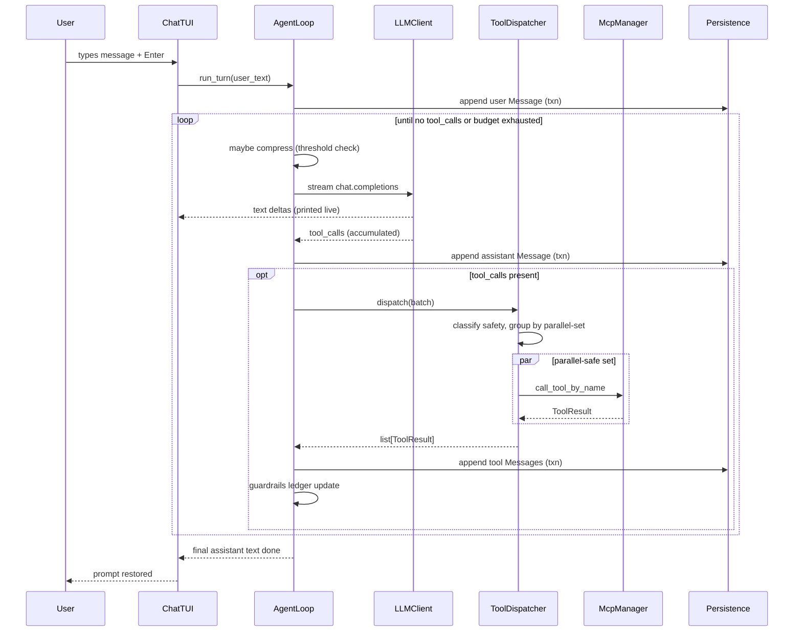
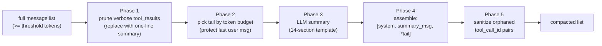

# Design Document

## Overview

The `claw chat` feature adds an interactive AI agent runtime to the existing `claw` CLI. It introduces a new top-level package `agent/` that lives alongside `cli/` and `gateway/`, plus a thin command module `cli/chat_cmd.py` that wires the runtime into the root argparse dispatcher.

The runtime follows the synchronous main-loop pattern proven in Hermes Agent:

- A single-threaded `AgentLoop` drives one Iteration per LLM call.
- Each Iteration may emit zero or more Tool_Calls; tools dispatch through a `ToolRegistry` that wraps the gateway's existing `McpManager`.
- A `ThreadPoolExecutor` (Tool_Worker_Pool) executes Tool_Calls concurrently when their `Parallel_Safety_Class` permits, sequentially otherwise.
- An `IterationBudget` plus a single Grace_Iteration prevents runaway loops.
- A `ContextCompressor` runs a 5-phase pipeline when token usage crosses a configurable threshold.
- A `GuardrailsController` watches for repeated identical or unproductive Tool_Calls and either warns or blocks based on configured mode.
- A `Persistence` layer writes every session and message to SQLite at `~/.claw/agent.db` in WAL mode.
- A `ChatTUI` renders streaming output and a Status_Line in `prompt_toolkit`.

### Design goals

- **Reuse, don't rewrite.** Model selection, provider routing, env-key resolution, MCP startup, and the argparse pattern all already exist in `cli/` and `gateway/`. The chat runtime composes them; it does not duplicate them.
- **No new dependencies.** The runtime targets the dependencies already declared in `pyproject.toml` (`prompt_toolkit`, `requests`, `python-dotenv`, `pydantic`, stdlib `sqlite3`, `urllib`, `concurrent.futures`). No `openai` SDK; streaming is implemented directly against the OpenAI-compatible chat-completions HTTP+SSE protocol.
- **Synchronous core, async edges.** The agent loop is synchronous (matches Hermes). The few asynchronous parts (gateway start, signal handling) live at the CLI boundary.
- **Cross-platform.** Windows, macOS, Linux. All TUI elements degrade gracefully (Status_Line falls back to periodic stderr lines when `prompt_toolkit` cannot install a key binding).
- **Property-friendly state.** Pure data shapes (`Message`, `AgentConfig`, `ToolCall`) are dataclasses with deterministic JSON encoding, so persistence and compression can be tested by round-trip property checks.

### Non-goals

This iteration explicitly excludes subagent delegation, persistent memory files (`MEMORY.md`), native non-OpenAI transports, multimodal input, and a plugin system. Those are deferred per requirements §"Out of Scope".

### Research summary

Two design questions required research:

1. **OpenAI streaming + tool_calls accumulation.** The OpenAI Chat Completions streaming protocol emits `data: {...}\n\n` SSE frames. A frame's `choices[0].delta` may carry `content` (string deltas) or `tool_calls` (an array of `{index, id?, type?, function: {name?, arguments?}}` deltas indexed by position). Tool-call fields arrive piecewise: `id` and `function.name` typically appear in the first delta for an index, and `function.arguments` arrives as a stream of JSON-text fragments that must be concatenated. The stream terminates with `data: [DONE]`. The accumulator design below mirrors this protocol exactly.
2. **prompt_toolkit Status_Line under streaming output.** `prompt_toolkit.Application` with a `Layout` containing `Window(BufferControl(...))` for the conversation and a `FormattedTextControl` bottom toolbar is the canonical pattern, but it interferes with streaming `print()` calls that bypass the layout. The accepted approach is one of two strategies, chosen at runtime based on whether stdout is a TTY: (a) full `Application` mode where the streaming buffer is appended to a `Buffer` and `app.invalidate()` is throttled to ≤2 Hz, or (b) plain-`print` mode where the Status_Line is emitted to stderr with `\r` carriage-return overwrites between deltas. We pick (b) for simplicity in this iteration; (a) is a future enhancement.

Token estimation uses a heuristic of `max(1, len(text) // 4)` characters-per-token, which is well within ±25% of GPT-4 tokenizer outputs for English/code mixed text and is the same heuristic used by Hermes when no tokenizer is available. Context-window sizes default to 32 K tokens and are overridable per model via `AgentConfig.model_context_windows`.

## Architecture

### Layered component diagram



### Sequence: one user turn (Interactive_Mode)



### Data flow: 5-phase compression



### Module / file layout

```
agent/
  __init__.py            # public exports: AgentLoop, AgentConfig, Message
  config.py              # AgentConfig dataclass + load/save
  messages.py            # Message dataclass + to_openai/from_openai/to_db_row/from_db_row
  llm_client.py          # LLMClient (HTTP+SSE streaming, non-streaming chat completions)
  tool_registry.py       # ToolRegistry — MCP tools -> OpenAI fn schema
  tool_dispatch.py       # ToolDispatcher — seq + parallel + safety classification
  guardrails.py          # GuardrailsController — exact/same_tool/idempotent bands
  compressor.py          # ContextCompressor — 5-phase pipeline
  persistence.py         # SqlitePersistence — sessions + messages + WAL
  title_generator.py     # TitleGenerator (auxiliary LLM call)
  loop.py                # AgentLoop — orchestrates everything
  tui.py                 # ChatTUI — prompt_toolkit REPL + Status_Line

cli/
  chat_cmd.py            # register_chat_parser, run_chat_command, slash-command dispatch
  main.py                # (modified) imports register_chat_parser, dispatches "chat"
```

### Boundary conventions

- **Synchronous calls only inside `agent/`.** Any HTTP, SQLite, or thread-pool call returns synchronously to the caller. Async is reserved for the gateway and the TUI's signal handlers.
- **No imports from `cli.*` inside `agent/`** except `agent.config` reading `cli.config.get_env_value` and `cli.providers.PROVIDER_INFO`. This keeps the runtime testable without the CLI shell.
- **`gateway.mcp_client` is the only allowed gateway dependency.** The chat runtime never instantiates a `GatewayServer`; it builds an `McpManager` directly from `gateway.config.load_gateway_config()`.

## Components and Interfaces

### `agent.config` — Agent configuration

```python
# agent/config.py
from dataclasses import dataclass, field
from typing import Dict

@dataclass
class AgentConfig:
    max_iterations: int = 90
    context_compression_threshold: float = 0.70
    protected_tail_fraction: float = 0.30      # tail = up to 30% of context window
    max_tool_workers: int = 4
    tool_call_timeout_seconds: int = 300
    guardrails_mode: str = "warn"              # "warn" | "enforce"
    default_context_window: int = 32_768
    model_context_windows: Dict[str, int] = field(default_factory=dict)
    summary_floor_tokens: int = 2_000
    summary_cap_tokens: int = 12_000
    summary_fraction: float = 0.20             # 20% of compressed region

def load_agent_config() -> AgentConfig: ...
def save_agent_config(cfg: AgentConfig) -> bool: ...
```

`load_agent_config` reads the `agent` object inside `~/.claw/config.json` via `cli.config.load_config`. Each field is validated; invalid types or out-of-range values fall back to the default and emit one stderr warning naming the offending key (Req 14.4).

### `agent.messages` — Message representation

```python
# agent/messages.py
from dataclasses import dataclass
from typing import Optional, List

@dataclass(frozen=True)
class Message:
    role: str                          # "system" | "user" | "assistant" | "tool"
    content: str
    tool_call_id: Optional[str] = None
    tool_name: Optional[str] = None
    tool_arguments: Optional[str] = None   # JSON text, sort_keys=True
    timestamp: int = 0                 # unix seconds; 0 means "fill at insert"
    id: Optional[int] = None           # SQLite rowid; None until persisted

    def to_openai(self) -> dict: ...
    @classmethod
    def from_openai(cls, raw: dict) -> "Message": ...
    def to_db_row(self, session_id: str) -> tuple: ...
    @classmethod
    def from_db_row(cls, row: tuple) -> "Message": ...

@dataclass(frozen=True)
class ToolCall:
    id: str
    name: str
    arguments_json: str    # raw JSON text emitted by LLM
```

`to_openai` emits the canonical OpenAI request format: `{"role": ..., "content": ...}` for system/user/assistant; assistant messages with tool calls also carry `tool_calls`; tool messages carry `tool_call_id` and `name`. `tool_arguments` is always re-encoded with `json.dumps(obj, sort_keys=True, ensure_ascii=False)` so byte-equal output is produced for equal-valued objects (Req 19.2). Round-trip `Message → DB row → Message` preserves the `(role, content, tool_call_id, tool_name, tool_arguments)` tuple (Req 19.1).

### `agent.llm_client` — OpenAI-compatible chat client

```python
# agent/llm_client.py
class LLMClient:
    def __init__(self, base_url: str, api_key: str, model: str,
                 timeout: float = 120.0): ...

    def stream_chat(self, messages: list[dict],
                    tools: Optional[list[dict]] = None,
                    on_text_delta: Callable[[str], None] = None,
                    on_status: Callable[[StreamStatus], None] = None,
                    interrupt: Optional[threading.Event] = None,
                    ) -> StreamResult: ...

    def chat(self, messages: list[dict],
             tools: Optional[list[dict]] = None) -> dict: ...
```

`stream_chat` uses `requests.post(..., stream=True)` to consume the SSE response. It parses each `data: {...}` line as JSON and feeds deltas to the **stream accumulator** described below. `on_text_delta` is invoked for every non-empty content delta. `on_status` is invoked at most twice per second with token estimates and tool-call counts. `interrupt` is checked between deltas; setting it stops further reads and finalises the partial assistant Message (Req 13.4).

`StreamResult` is a small dataclass: `{content: str, tool_calls: list[ToolCall], finish_reason: str, prompt_tokens: int|None, completion_tokens: int|None}`. The token counts come from the final SSE frame's `usage` field when the provider sends it (OpenRouter/Nous do; not all providers do — when missing, we fall back to char/4 heuristics).

#### Stream accumulator

The accumulator is a single dict keyed by `tool_call.index`:

```python
class _ToolCallAccumulator:
    def __init__(self):
        self._slots: dict[int, dict] = {}   # index -> {"id": str, "name": str, "arguments": str}

    def feed_delta(self, delta_tool_calls: list[dict]) -> None:
        for entry in delta_tool_calls:
            idx = entry["index"]
            slot = self._slots.setdefault(idx, {"id": "", "name": "", "arguments": ""})
            if "id" in entry and entry["id"]:
                slot["id"] = entry["id"]
            fn = entry.get("function") or {}
            if fn.get("name"):
                slot["name"] = fn["name"]
            if "arguments" in fn:
                slot["arguments"] += fn["arguments"]

    def finalize(self) -> list[ToolCall]:
        return [ToolCall(id=v["id"], name=v["name"], arguments_json=v["arguments"])
                for _, v in sorted(self._slots.items())]
```

The accumulator never validates JSON during feeding. JSON parsing happens only in `ToolDispatcher.execute`, which means a malformed-arguments error becomes a normal tool failure (Req 7.5) rather than a crash inside the streaming reader.

### `agent.tool_registry` — MCP-to-OpenAI bridge

```python
# agent/tool_registry.py
class ToolRegistry:
    def __init__(self, mcp: McpManager): ...
    def reload_from_mcp(self) -> None: ...
    def openai_tools(self) -> list[dict]: ...
    def get(self, tool_name: str) -> Optional[ToolDef]: ...
    def safety_class(self, tool_name: str) -> str: ...   # _NEVER_PARALLEL by default
```

`openai_tools()` returns `[{"type": "function", "function": {"name": ..., "description": ..., "parameters": <input_schema>}}]`. MCP `input_schema` JSON Schema fragments are passed through unchanged — every supported provider accepts the standard JSON-Schema dialect.

Safety classification: MCP tools have no safety metadata in the protocol, so all MCP tools default to `_NEVER_PARALLEL` (Req 8.5). The registry exposes a hook (`set_safety_override(name, cls)`) so a future skill or config file can opt specific tools into `_PARALLEL_SAFE` or `_PATH_SCOPED`; this iteration ships with no overrides.

### `agent.tool_dispatch` — Tool execution

```python
# agent/tool_dispatch.py
class ToolDispatcher:
    def __init__(self, registry: ToolRegistry, mcp: McpManager,
                 guardrails: GuardrailsController,
                 max_workers: int, timeout_s: int): ...

    def execute(self, batch: list[ToolCall],
                interrupt: threading.Event) -> list[Message]: ...
```

For each batch:

1. Classify safety: if every involved tool is `_PARALLEL_SAFE`, run all concurrently. If any is `_NEVER_PARALLEL`, run all sequentially in LLM-emitted order (Req 8.3). For `_PATH_SCOPED`, group by non-overlapping path arguments (Req 8.4).
2. Before dispatch, ask `GuardrailsController.should_dispatch(tool_call)` — if it returns a synthetic `Message` (block), append it instead and skip the call.
3. Submit allowed calls to the `ThreadPoolExecutor` (or run inline when sequential). Each worker validates JSON arguments, calls `mcp.call_tool_by_name`, and produces a `Message(role="tool", ...)`. Timeouts use `Future.result(timeout=timeout_s)` and produce a synthetic timeout Message (Req 7.9).
4. After every result, update the guardrails ledger with the outcome.
5. The `interrupt` event is passed into each worker; workers check it before calling MCP, and the dispatcher cancels pending futures when the event is set (Req 8.6).

### `agent.guardrails` — Tool-loop guardrails

```python
# agent/guardrails.py
@dataclass
class GuardrailLedger:
    exact_failures: dict[str, int]            # tool_hash -> consecutive failure count
    same_tool_failures: dict[str, int]        # tool_name -> consecutive failure count
    idempotent_runs: dict[str, list[str]]     # tool_hash -> list of recent result hashes

class GuardrailsController:
    def __init__(self, mode: str): ...
    def should_dispatch(self, call: ToolCall) -> Optional[Message]: ...
    def record_outcome(self, call: ToolCall, result: Message) -> Optional[Message]: ...
```

`Tool_Hash` is `sha256(tool_name + "\u0000" + json.dumps(args, sort_keys=True))`. Bands per requirements §9: `exact_failure` warn at 2 / block at 5; `same_tool_failure` warn at 3 / halt at 8; `idempotent_no_progress` warn at 2 identical successful results / block at 5. When `mode == "warn"`, only warn-band Messages are emitted; block/halt bands are downgraded to additional warnings. When `mode == "enforce"`, block returns a synthetic `tool` Message; halt raises `AgentLoop.Halt` which the loop catches and exits cleanly (Req 9.5).

### `agent.compressor` — 5-phase context compression

```python
# agent/compressor.py
class ContextCompressor:
    def __init__(self, llm: LLMClient, agent_cfg: AgentConfig,
                 token_estimator: Callable[[str], int]): ...

    def compress(self, history: list[Message],
                 *, topic: Optional[str] = None,
                 force: bool = False) -> CompressionResult: ...
```

`CompressionResult` carries `messages: list[Message]`, `before_tokens: int`, `after_tokens: int`, `succeeded: bool`. The five phases mirror requirements §10.6 exactly:

- **Phase 1 — Prune.** Inside the to-be-compressed prefix, every `tool` Message whose content exceeds 800 chars is replaced by a one-line synthetic summary: `[<tool_name>] {first_line[:120]} ... ({n_lines} lines, {n_chars} chars)`. The first system message and the protected tail are untouched.
- **Phase 2 — Boundary selection.** Walk messages from newest to oldest accumulating `token_estimator(msg.content)`. Stop when the accumulator reaches `protected_tail_fraction * context_window`. Then: ensure the latest user Message is included (extend the tail until it is); align the boundary so it never splits an `assistant`-with-`tool_calls` group from its corresponding `tool` Messages (slide the boundary one step earlier or later to keep the group whole). The first system Message is always kept as the head.
- **Phase 3 — Summary generation.** Build a prompt: `[system_message_with_template, user_message_with_compressed_region]`. The `Summary_Budget` = `clamp(0.20 * compressed_tokens, 2000, 12000)`. Call `LLMClient.chat` (non-streaming) with `max_tokens=Summary_Budget`. The system instruction enforces the 14-section template and the `_(none)_` rule for empty sections (Req 12.1, 12.2). When `topic` is provided, prepend `Focus on: <topic>.` to the system instruction (Req 11.2).
- **Phase 4 — Assemble.** Result = `[head_system_message, summary_message, *protected_tail]`. The `summary_message` has role `system`, content begins with the marker line `<!-- claw_chat:compression_summary v1 -->\n` (Req 12.3), and is tagged with `tool_name="__compression_summary__"` so it never re-enters the prune-tool-results pass.
- **Phase 5 — Sanitize.** Walk the assembled list once: for every `tool` Message, look upstream within the assembled list for an `assistant` Message whose `tool_calls` carry the same `tool_call_id`; if none is found, drop the orphaned `tool` Message. For every `assistant` Message that emits `tool_call_id`s, drop call entries whose corresponding `tool` Messages were lost.

Anti-thrashing (Req 10.7): the compressor maintains a per-Session `recent_reductions: list[float]`. After two consecutive passes where reduction <10%, automatic compression is skipped for the rest of the Session. Manual `/compact` always passes `force=True` and bypasses the skip (Req 11.3).

### `agent.persistence` — SQLite session/message storage

```python
# agent/persistence.py
class SqlitePersistence:
    SCHEMA_VERSION = 1
    DEFAULT_PATH = Path.home() / ".claw" / "agent.db"

    def __init__(self, path: Path = DEFAULT_PATH): ...
    def initialize(self) -> None: ...
    def create_session(self, model: str) -> Session: ...
    def get_session(self, id_prefix: str) -> Session: ...
    def list_sessions(self) -> list[Session]: ...
    def append_messages(self, session_id: str,
                        messages: list[Message],
                        total_tokens: int) -> list[Message]: ...
    def load_recent_messages(self, session_id: str, limit: int = 500) -> list[Message]: ...
    def update_title(self, session_id: str, title: str) -> None: ...
```

Connection setup runs `PRAGMA journal_mode=WAL; PRAGMA synchronous=NORMAL; PRAGMA foreign_keys=ON;` on every fresh connection (Req 18.1). Writes are wrapped in `BEGIN IMMEDIATE; ... COMMIT;` and retried up to two times on `sqlite3.OperationalError` with linear backoff of 0.1 s and 0.3 s (Req 18.3). On the third failure the call raises `PersistenceFailure`, which the loop converts to either `sys.exit(1)` (one-shot) or a stderr warning + REPL return (interactive).

### `agent.title_generator`

```python
class TitleGenerator:
    def __init__(self, llm: LLMClient): ...
    def generate(self, messages: list[Message]) -> Optional[str]: ...
```

Trigger: the loop calls `generate()` after each turn when `session.title is empty` and `count(user messages) >= 2`. Returns `None` on provider error or empty response, which leaves the title blank and lets the next turn retry (Req 4.3). Output is truncated to 80 chars and stripped of newlines.

### `agent.loop` — Orchestrator

```python
# agent/loop.py
class AgentLoop:
    def __init__(self, *, cfg: AgentConfig, llm: LLMClient, mcp: McpManager,
                 registry: ToolRegistry, dispatcher: ToolDispatcher,
                 compressor: ContextCompressor, guardrails: GuardrailsController,
                 persistence: SqlitePersistence, session: Session,
                 token_estimator: Callable[[str], int],
                 emit: Callable[[StreamEvent], None]): ...

    def run_oneshot(self, query: str) -> int: ...   # exit code
    def run_turn(self, user_text: str) -> None: ...
```

Per-turn pseudocode:

```
self._iteration_count = 0
self._budget_notice_sent = False
self.history.append(Message(role="user", content=user_text))
persistence.append_messages(session.id, [user_message], total_tokens)

while True:
    self._iteration_count += 1
    if self._iteration_count > cfg.max_iterations + 1:
        break    # grace iteration consumed
    if self._iteration_count == cfg.max_iterations + 1 and not self._budget_notice_sent:
        notice = Message(role="system", content=BUDGET_EXHAUSTION_TEXT)
        self.history.append(notice); persistence.append_messages(...)
        self._budget_notice_sent = True

    # Compression (auto)
    if self._estimated_prompt_tokens() > cfg.context_compression_threshold * context_window:
        result = compressor.compress(self.history, force=False)
        if result.succeeded:
            self.history = result.messages
            persistence.persist_summary(...)

    # LLM call
    stream_result = llm.stream_chat(
        messages=[m.to_openai() for m in self.history],
        tools=registry.openai_tools(),
        on_text_delta=emit_text,
        interrupt=self._interrupt_event,
    )
    assistant_msg = Message(role="assistant", content=stream_result.content,
                            tool_arguments=encode_tool_calls(stream_result.tool_calls))
    self.history.append(assistant_msg)
    persistence.append_messages(...)

    if not stream_result.tool_calls:
        break

    tool_messages = dispatcher.execute(stream_result.tool_calls, self._interrupt_event)
    self.history.extend(tool_messages)
    persistence.append_messages(...)

    if guardrails.should_halt():
        break
```

Interrupt flag (`self._interrupt_event = threading.Event()`) is set from the SIGINT handler installed by `cli/chat_cmd.py`. Workers check it before each MCP call; the streaming reader checks it between deltas.

### `agent.tui` — Interactive REPL and Status_Line

```python
# agent/tui.py
class ChatTUI:
    def __init__(self, loop: AgentLoop, slash: SlashCommandDispatcher): ...
    def run(self) -> int: ...     # exit code
```

Implementation strategy (chosen after research): the simpler "plain-print + stderr Status_Line" approach.

- The REPL uses `prompt_toolkit.PromptSession` which already handles cross-platform line editing, history, and arrow keys — no `Application` wrapper is needed.
- During an Agent_Loop turn, text deltas are written directly to stdout via `print(..., end="", flush=True)`.
- The Status_Line is rendered to `stderr` with `\r` (carriage return) and `\x1b[K` (erase-to-end-of-line) prefixed to overwrite the previous render. Update rate is throttled to 2 Hz (Req 13.3) by checking `time.monotonic() - last_render >= 0.5`.
- When the loop finishes a turn, the TUI prints `\n` to stdout and clears the Status_Line with `\r\x1b[K\n` to stderr (Req 13.2).
- Detection: when stderr is not a TTY (e.g., piped), the Status_Line is suppressed and replaced with periodic `INFO`-level log lines.

Slash-command dispatch:

```python
class SlashCommandDispatcher:
    def __init__(self, loop: AgentLoop, persistence: SqlitePersistence): ...
    def is_slash(self, line: str) -> bool: ...
    def dispatch(self, line: str) -> SlashResult: ...   # CONTINUE | QUIT | SWITCH_SESSION
```

Supported commands (Req 2.7): `/help`, `/quit`, `/new`, `/sessions`, `/compact`, `/compact <topic>`. Each handler returns `CONTINUE`, `QUIT`, or `SWITCH_SESSION`. Unknown slash commands print an error and return `CONTINUE`.

### `cli.chat_cmd` — CLI integration

```python
# cli/chat_cmd.py
def register_chat_parser(subparsers): ...
def run_chat_command(args) -> bool: ...
```

`register_chat_parser` mirrors `register_gateway_parser`'s pattern (one parser, mutually exclusive validation in the dispatcher rather than via argparse so we can produce custom error text per Req 15.4 and 15.5):

```python
chat = subparsers.add_parser("chat", help="Run an interactive AI agent")
chat.add_argument("-q", "--query", help="One-shot query (omit for interactive REPL)")
chat.add_argument("--session", metavar="ID", help="Resume a session by 4-hex prefix")
chat.add_argument("--new", action="store_true", help="Start a fresh session")
chat.add_argument("--model", help="Override the configured model for this run")
chat.add_argument("--list-sessions", action="store_true", help="List sessions and exit")
chat.add_argument("--verbose", "-v", action="store_true", help="DEBUG logging")
```

`run_chat_command` is the dispatcher: validate flag combinations → resolve model+provider → assemble the runtime → route to one-shot or interactive mode. The model resolution uses `cli.config.get_selected_provider() / get_selected_model()` and `cli.config.get_env_value(provider_info["api_key_env"])`, matching the existing pattern in `cli/models_cmd.py` exactly.

## Data Models

### In-memory dataclasses

- `Message` (frozen) — see §"agent.messages".
- `ToolCall` — `id: str`, `name: str`, `arguments_json: str`.
- `Session` — `id: str (UUIDv4)`, `short_id: str (first 4 hex)`, `title: str`, `created_at: int`, `updated_at: int`, `model: str`, `total_tokens: int`.
- `AgentConfig` — see §"agent.config".
- `StreamResult`, `CompressionResult`, `GuardrailLedger` — internal value types.

### SQLite schema

```sql
-- Schema version tracking.
CREATE TABLE IF NOT EXISTS meta (
    key   TEXT PRIMARY KEY,
    value TEXT NOT NULL
);

-- Sessions table.
CREATE TABLE IF NOT EXISTS sessions (
    id           TEXT PRIMARY KEY,                  -- UUIDv4
    title        TEXT NOT NULL DEFAULT '',
    created_at   INTEGER NOT NULL,
    updated_at   INTEGER NOT NULL,
    model        TEXT NOT NULL,
    total_tokens INTEGER NOT NULL DEFAULT 0
);
CREATE INDEX IF NOT EXISTS idx_sessions_updated_at ON sessions(updated_at DESC);

-- Messages table.
CREATE TABLE IF NOT EXISTS messages (
    id              INTEGER PRIMARY KEY AUTOINCREMENT,
    session_id      TEXT NOT NULL REFERENCES sessions(id) ON DELETE CASCADE,
    role            TEXT NOT NULL CHECK (role IN ('system','user','assistant','tool')),
    content         TEXT NOT NULL DEFAULT '',
    tool_call_id    TEXT,
    tool_name       TEXT,
    tool_arguments  TEXT,                            -- JSON, sort_keys=True
    timestamp       INTEGER NOT NULL
);
CREATE INDEX IF NOT EXISTS idx_messages_session_id ON messages(session_id, id);
```

PRAGMAs applied on every connection: `journal_mode=WAL`, `synchronous=NORMAL`, `foreign_keys=ON`, `temp_store=MEMORY`.

Migrations: `initialize()` reads `meta.schema_version` (or sets it to `1` on first run) and applies migrations idempotently (Req 18.4). The current target is `1`; later migrations will add rows to a `_migrations` constant list.

### Session_Id resolution

Per Req 3.5, the `Session_Id` shown to users is the first 4 hex chars of the UUID. `get_session(id_prefix)` runs `SELECT id FROM sessions WHERE substr(id,1,length(?))=? COLLATE NOCASE` and returns the row when exactly one match exists. Zero matches → raises `SessionNotFound`. Multiple matches → raises `AmbiguousSession` carrying the colliding short IDs; the caller renders them and exits with code 2 (Req 3.10).

### Title Storage

Titles are TEXT NOT NULL DEFAULT ''. The empty string represents "untitled". `update_title` is a no-op when the existing title is non-empty (Req 4.4) — it executes `UPDATE sessions SET title=? WHERE id=? AND title=''`.

### Tool argument canonicalisation

For both the in-memory `Message.tool_arguments` field and the SQLite `tool_arguments` column, the value is always the output of `json.dumps(parsed, sort_keys=True, ensure_ascii=False)` when parsed successfully, or the raw string from the LLM when parsing fails (the failure case is itself recorded as a tool error message, never as a successful call). This guarantees byte-equal round-trips (Req 19.2) and a stable hash input for the GuardrailsController.

### Token estimation

`token_estimator(text: str) -> int` returns `max(1, len(text) // 4)`. The estimator is injected into every component that needs token math so a future tokenizer (e.g., `tiktoken`) can replace it without API changes.


## Correctness Properties

*A property is a characteristic or behavior that should hold true across all valid executions of a system — essentially, a formal statement about what the system should do. Properties serve as the bridge between human-readable specifications and machine-verifiable correctness guarantees.*

### Reflection — redundancy check

The full prework analysis surfaced ~50 testable acceptance criteria. After reflection, the following consolidations were applied:

- Round-trip persistence (Req 19.1) and JSON canonicalisation (Req 19.2) cover the same encoding determinism that Tool_Hash determinism (Req 9.1) also relies on. JSON canonicalisation is folded into Property 4 (Tool_Hash determinism) so it is exercised independently of persistence; the round-trip property in Property 1 then covers the persistence-specific invariant.
- The exact-failure (Req 9.2/9.3), same-tool-failure (Req 9.4/9.5), and idempotent-no-progress (Req 9.6/9.7) bands are all variants of "counter fires at threshold N"; they collapse into one Property 12 that ranges over (band, threshold, sequence).
- The auto-trigger anti-thrashing skip (Req 10.7) and the manual `/compact` bypass (Req 11.3) are two sides of the same rule; they collapse into Property 5.
- Iteration budget exhaustion notice (Req 6.3) and grace iteration termination (Req 6.4) are jointly expressed as "iteration count never exceeds max+1 and exactly one notice exists"; they collapse into Property 3.
- Default `_NEVER_PARALLEL` (Req 8.5) is a special case of safety-class scheduling (Req 8.2/8.3/8.4); they collapse into Property 25.
- Bounded in-memory history (Req 16.1) and strict session scoping (Req 16.3) are both invariants on the in-memory message buffer; they collapse into Property 17.
- Title trigger conditions (Req 4.1) and overwrite protection (Req 4.4) and length bound (Req 4.2) all describe the post-conditions of one operation; they collapse into Property 18.
- Tool-call timeout (Req 7.8) and timeout-Message generation (Req 7.9) are the two halves of one observable event; they collapse into Property 26.
- Stream interruption (Req 13.4), Ctrl+C in loop (Req 2.8), and parallel cancellation (Req 8.6) are three triggers of one mechanism; they collapse into Property 24.

Acceptance criteria classified as `EXAMPLE`, `EDGE_CASE`, `INTEGRATION`, or `SMOKE` in the prework do not appear here; they are addressed in the Testing Strategy section as example-based unit tests, smoke tests, or integration tests.

### Properties

### Property 1: Round-trip persistence

*For any* sequence of valid `Message` instances persisted to a fresh SQLite database under a single Session, loading them back via `SqlitePersistence.load_recent_messages` SHALL produce a list whose ordered `(role, content, tool_call_id, tool_name, tool_arguments)` tuples are equal to the originally written tuples.

**Validates: Requirements 19.1, 19.2**

### Property 2: Compression preserves the last user message

*For any* conversation history with at least one `user` Message, the `messages` field of `ContextCompressor.compress(history).messages` SHALL contain the most recent `user` Message from the input history with identical `content` and `tool_call_id`.

**Validates: Requirements 10.4**

### Property 3: Iteration budget bound and single budget notice

*For any* `max_iterations >= 1` and any LLM that always emits at least one tool call (i.e., would loop forever), one invocation of `AgentLoop.run_turn` SHALL terminate after exactly `max_iterations + 1` Iterations, and the resulting message history SHALL contain exactly one system Message tagged with the budget-exhaustion marker.

**Validates: Requirements 6.3, 6.4**

### Property 4: Tool_Hash determinism (canonical JSON)

*For any* `tool_name: str` and any pair of equal-valued JSON-encodable objects `args1, args2` (i.e., differing only in dict key insertion order or in numerically-equal float representations within Python's JSON encoder), the `tool_hash(tool_name, args1)` SHALL equal `tool_hash(tool_name, args2)`. Equivalently, `json.dumps(args, sort_keys=True, ensure_ascii=False)` is deterministic on JSON-equivalent inputs.

**Validates: Requirements 9.1, 19.2**

### Property 5: Anti-thrashing skip with manual bypass

*For any* `Session` in which two consecutive automatic `ContextCompressor.compress(force=False)` passes each yield `after_tokens / before_tokens > 0.90` (i.e., reduction less than 10%), the next call with `force=False` SHALL be a no-op (return the original history unchanged), AND the next call with `force=True` SHALL still execute the full pipeline.

**Validates: Requirements 10.7, 11.3**

### Property 6: SQLite WAL allows concurrent writers without corruption

*For any* `N` writer threads (1 ≤ N ≤ 16) each appending a random batch of `Message`s to the same `SqlitePersistence` instance pointing at one database file, after all threads complete the database SHALL contain exactly `sum(batch_sizes)` rows in the `messages` table, the schema SHALL satisfy `PRAGMA integrity_check == "ok"`, and every persisted row SHALL satisfy the table CHECK constraints.

**Validates: Requirements 18.1, 18.2**

### Property 7: Compression tail-fraction token budget

*For any* conversation history and any `protected_tail_fraction f ∈ (0, 1)`, the Protected_Tail selected by Phase 2 SHALL satisfy `tail_token_total ≥ f * context_window` OR the tail SHALL be the entire history, AND `tail_token_total ≤ f * context_window + max(token_estimator(m.content) for m in history)`.

**Validates: Requirements 10.3**

### Property 8: Summary budget clamp

*For any* compressed-region token total `c ≥ 0`, the computed `summary_budget` SHALL equal `min(12000, max(2000, int(0.20 * c)))`.

**Validates: Requirements 10.5**

### Property 9: Phase-5 sanitisation eliminates orphan tool/assistant pairs

*For any* assembled message list produced by Phase 4, the output of Phase 5 SHALL satisfy: every `Message` with `role == "tool"` has at least one upstream `Message` with `role == "assistant"` and a `tool_calls` entry whose `id == tool.tool_call_id`, AND every `tool_calls` entry on an assistant Message has a downstream `tool` Message with the matching `tool_call_id`.

**Validates: Requirements 10.6**

### Property 10: Compression preserves pre-compression history in DB

*For any* Session and any successful compression pass, the count of rows in the `messages` table for that `session_id` immediately after compression SHALL be greater than or equal to the count immediately before, AND a new row with `role == "system"` and `tool_name == "__compression_summary__"` SHALL exist.

**Validates: Requirements 10.8**

### Property 11: 14-section summary template emitted with `_(none)_` for empties

*For any* response from the summary LLM call (including empty or partial responses), the post-processed summary Message body SHALL contain all 14 level-2 Markdown headings (`## Active Task`, `## Completed Actions`, `## Blocked`, `## User Preferences`, `## Files & Resources`, `## Decisions Made`, `## Open Questions`, `## Errors Encountered`, `## Tools Used`, `## Key Findings`, `## Next Steps`, `## Out of Scope`, `## References`, `## Notes`) in that exact order, AND every section that has no relevant content SHALL be followed by the literal line `_(none)_`.

**Validates: Requirements 12.1, 12.2**

### Property 12: Guardrail counters fire at exact thresholds

*For any* `band ∈ {exact_failure, same_tool_failure, idempotent_no_progress}` and *for any* sequence of `(ToolCall, success: bool)` outcomes, the GuardrailsController SHALL emit the warn-band Message exactly when the `band`'s counter equals its warn threshold (2, 3, 2 respectively) and SHALL emit the block/halt Message exactly when the counter equals its block/halt threshold (5, 8, 5 respectively).

**Validates: Requirements 9.2, 9.3, 9.4, 9.5, 9.6, 9.7**

### Property 13: Guardrails mode switch

*For any* failure sequence and any guardrails configuration, in `mode == "warn"` no Message produced by the GuardrailsController SHALL be a block or halt Message; in `mode == "enforce"`, blocking and halting SHALL occur exactly at the thresholds defined in Property 12.

**Validates: Requirements 9.8**

### Property 14: Idempotent message append

*For any* batch of `Message` instances returned by an initial `append_messages` call (each carrying its assigned `id`), passing the identical batch back through `append_messages` a second time SHALL produce no new rows in the `messages` table and SHALL return references to the existing rows.

**Validates: Requirements 3.7**

### Property 15: Atomic batch metadata updates

*For any* sequence of `append_messages(session_id, batch_i, total_tokens_i)` calls completed in order, the persisted `sessions.updated_at` SHALL be monotonically non-decreasing across calls AND `sessions.total_tokens` SHALL equal the most recent `total_tokens_i` after each call.

**Validates: Requirements 3.6**

### Property 16: Session prefix lookup correctness

*For any* set of stored sessions and any `prefix` of length 4, `SqlitePersistence.get_session(prefix)` SHALL return the unique session whose UUID starts with `prefix` when exactly one match exists, raise `SessionNotFound` when zero match, and raise `AmbiguousSession` carrying the colliding short IDs when more than one matches. The short ID of any session SHALL be the first 4 hexadecimal characters of its UUIDv4.

**Validates: Requirements 3.5, 3.8, 3.10**

### Property 17: Bounded in-memory history with strict session scoping

*For any* persisted Session containing `N >= 0` Messages, after `AgentLoop.load_session(session_id)` the in-memory `history` SHALL satisfy `len(history) <= 501` AND every `Message` in `history` SHALL have been originally written under the active `session_id` (no cross-session contamination).

**Validates: Requirements 16.1, 16.3**

### Property 18: Title update monotonicity and length bound

*For any* generated title string `t` from `TitleGenerator.generate`, when not `None` the persisted title SHALL satisfy `1 <= len(persisted) <= 80`. *For any* Session whose `title` field is already non-empty, calls to `update_title(session_id, new_title)` SHALL leave the existing title unchanged. Titles are only generated when `count(user_messages) >= 2` and the existing title is empty.

**Validates: Requirements 4.1, 4.2, 4.4**

### Property 19: Config loader is total

*For any* JSON-decodable dict supplied as the `agent` block of `~/.claw/config.json`, `load_agent_config` SHALL return an `AgentConfig` whose every field satisfies its type and range constraints. Missing keys SHALL take the documented defaults; keys with wrong types or out-of-range values SHALL take the documented defaults AND a one-line warning naming the offending key SHALL be written to stderr.

**Validates: Requirements 14.3, 14.4**

### Property 20: Stream delta concatenation

*For any* sequence of SSE `delta.content` fragments produced by an OpenAI-compatible streaming response, the concatenation of all values passed to `on_text_delta` SHALL equal `StreamResult.content`.

**Validates: Requirements 2.4, 13.1**

### Property 21: Status line render throttle

*For any* sequence of `request_render(t_i)` calls with monotonically non-decreasing wall-clock times `t_i`, the count of actual renders performed across an interval `[t_0, t_n]` SHALL be at most `2 * (t_n - t_0) + 1`.

**Validates: Requirements 13.3**

### Property 22: Loop terminates on empty tool_calls

*For any* sequence of mocked `StreamResult`s whose final element has `tool_calls == []`, `AgentLoop.run_turn` SHALL terminate within `len(sequence)` Iterations and SHALL return the final element's `content` as the in-memory history's last assistant Message.

**Validates: Requirements 2.3**

### Property 23: REPL dispatch routing

*For any* non-empty input line `s`, the `ChatTUI._handle_line` method SHALL invoke `SlashCommandDispatcher.dispatch(s)` exactly when `s.startswith("/")` AND SHALL invoke `AgentLoop.run_turn(s)` exactly when `not s.startswith("/")`. The two paths are mutually exclusive.

**Validates: Requirements 2.2**

### Property 24: Interrupt terminates loop and pending workers

*For any* in-progress `AgentLoop` execution and any moment at which `interrupt_event.set()` is called, the loop SHALL terminate within one additional Iteration, all pending `ToolDispatcher` worker futures SHALL observe the event and produce a synthetic interruption Message, AND control SHALL return to the caller (REPL prompt or one-shot exit) without raising.

**Validates: Requirements 2.8, 8.6, 13.4**

### Property 25: Safety-class scheduling

*For any* batch of `ToolCall`s with mixed `Parallel_Safety_Class` annotations, the `ToolDispatcher` SHALL schedule them as follows:
- if every involved tool is `_PARALLEL_SAFE`, the start times of all calls SHALL precede the end time of any single call (concurrent execution);
- if any involved tool is `_NEVER_PARALLEL`, the start time of the i-th call SHALL be greater than or equal to the end time of the (i-1)-th call, in LLM-emitted order (sequential execution);
- if every involved tool is `_PATH_SCOPED`, calls whose path arguments overlap SHALL run sequentially while non-overlapping calls SHALL run concurrently;
- in the absence of explicit overrides, all MCP tools SHALL receive the `_NEVER_PARALLEL` classification.

**Validates: Requirements 8.2, 8.3, 8.4, 8.5**

### Property 26: Tool timeout cancellation

*For any* `tool_call_timeout_seconds t >= 1` and any tool whose execution duration exceeds `t`, the `ToolDispatcher` SHALL cancel the worker future, append exactly one `tool` Message whose content describes the timeout, AND continue the Agent_Loop without raising.

**Validates: Requirements 7.8, 7.9**

### Property 27: Invalid JSON tool args produce error Message and skip MCP call

*For any* `ToolCall` whose `arguments_json` cannot be decoded by `json.loads`, the `ToolDispatcher` SHALL append exactly one `tool` Message with content describing the parse error, SHALL NOT invoke `mcp.call_tool_by_name`, AND SHALL allow the Agent_Loop to continue.

**Validates: Requirements 7.5**

### Property 28: Idempotent schema initialization

*For any* number of consecutive `SqlitePersistence.initialize()` invocations on the same database file, the resulting schema (table names, column names, column types, indexes) SHALL be byte-identical and `PRAGMA integrity_check` SHALL return `"ok"` after each call.

**Validates: Requirements 18.4**

### Property 29: Persistence retry is bounded at three attempts

*For any* underlying SQLite operation that fails with `OperationalError` `k` times before succeeding, `SqlitePersistence._retry` SHALL return the success result when `k <= 2` and SHALL raise `PersistenceFailure` when `k >= 3`. The total retry count SHALL never exceed three attempts (one initial + two retries).

**Validates: Requirements 18.3**

### Property 30: Secret redaction in logs

*For any* keyword-argument pair `(name, value)` passed to a logger configured with the Claw_Chat redaction filter, where `name` matches the patterns `*API_KEY*` or `*TOKEN*` (case-insensitive) and `len(value) > 16`, the emitted log record SHALL NOT contain the substring `value` and SHALL contain a redaction marker (e.g., `***`) in its place.

**Validates: Requirements 17.3**

## Error Handling

### Error taxonomy

Errors are routed by the layer that originates them and bubble up to the loop or CLI dispatcher.

| Error class | Origin | Loop response | One-shot exit | Interactive exit |
|---|---|---|---|---|
| `ConfigError` | `agent.config` | abort startup before loop | 2 | 2 |
| `ProviderHTTPError` | `agent.llm_client` | append assistant error msg, halt turn | 1 | return to REPL |
| `ProviderRateLimited` | `agent.llm_client` | back off + retry up to 2x | 1 if persists | return to REPL |
| `ToolJSONDecodeError` | `agent.tool_dispatch` | append `tool` error msg, continue | n/a | n/a |
| `ToolTimeout` | `agent.tool_dispatch` | append synthetic timeout msg, continue | n/a | n/a |
| `McpUnavailable` | `gateway.mcp_client` | append `tool` error msg, continue | n/a | n/a |
| `GuardrailHalt` | `agent.guardrails` | clean halt + halt notice | 0 (halt is intentional) | return to REPL |
| `IterationBudgetExhausted` | `agent.loop` | append notice + run grace iter, then halt | 0 (intentional) | return to REPL |
| `CompressionFailed` | `agent.compressor` | leave history unchanged, warn, continue | n/a | n/a |
| `PersistenceFailure` | `agent.persistence` | abort current turn after 3 retries | 1 | return to REPL |
| `SessionNotFound` | `agent.persistence` | print to stderr, exit | 2 | 2 (during startup) |
| `AmbiguousSession` | `agent.persistence` | list collisions, print to stderr | 2 | 2 (during startup) |
| `KeyboardInterrupt` | OS signal | set interrupt event, finalise turn | 130 | return to REPL |

### Error Message conventions

When the Agent_Loop converts an internal exception into a conversation Message it MUST follow these conventions:

- **Tool errors** are written as `Message(role="tool", tool_call_id=..., tool_name=..., content="<one-line error>: <details>")`. The first line is a short identifier (`json_decode_error`, `mcp_unavailable`, `tool_timeout`); subsequent lines may carry traceback text up to 1 KB.
- **Loop-level notices** (budget exhaustion, interruption, halt) are written as `Message(role="system", content="<marker> <description>")` with markers `[claw_chat:budget_exhausted]`, `[claw_chat:interrupted]`, `[claw_chat:guardrail_halt]`.
- **Compression summaries** are written as `Message(role="system", tool_name="__compression_summary__", content="<!-- claw_chat:compression_summary v1 -->\n<14 sections>")`.

These markers are referenced by Property 3, Property 11, Property 24, and the persistence round-trip property to keep error states observable without requiring a separate event log.

### Crash recovery

The runtime is built around the principle that **persistence happens before the next user-visible action**. After every Iteration the loop calls `persistence.append_messages` inside a single transaction. If that transaction fails three times the turn is aborted and the user is informed; the previous turn's state is preserved on disk. On next startup, resuming the Session loads exactly the persisted history, so an interrupted turn replays without inconsistency.

### CLI-level error handling

`run_chat_command` catches three top-level exceptions:

1. `ConfigError` — print human-readable message, exit 2.
2. `KeyboardInterrupt` — print `Cancelled.` to stderr, exit 130.
3. `Exception` (any other) — print `claw chat: unrecoverable error: <type>: <message>` to stderr, exit 1. Full traceback is emitted only when `--verbose` is set.

## Testing Strategy

### Property-based testing applies

PBT applies to this feature. The runtime has substantial pure logic — JSON canonicalisation, token-budget arithmetic, compression boundary selection, guardrail counters, persistence round-trips, scheduling-by-safety-class — where universal properties hold and 100+ generated inputs reveal edge cases that example tests miss. PBT does NOT apply to: prompt_toolkit rendering details, gateway subprocess startup, network behaviour of provider endpoints, OS-level signal handling — these are tested with example or smoke tests instead.

### PBT framework

The Python ecosystem standard is **Hypothesis** (https://hypothesis.readthedocs.io/). It supports stateful machines, custom strategies, shrinking, and integrates with `pytest`, which is already declared in `[dev]` extras.

`Hypothesis` SHALL be added to the `[dev]` extras section of `pyproject.toml`:

```toml
dev = [..., "hypothesis==6.128.0", ...]
```

This is the only new dependency; it lives in `dev` extras only, never in the runtime install.

### Test layout

```
tests/
  agent/
    test_messages_roundtrip.py        # Property 1, 4
    test_compressor_invariants.py     # Properties 2, 5, 7, 8, 9, 10, 11
    test_loop_iteration_budget.py     # Properties 3, 22, 24
    test_guardrails_counters.py       # Properties 12, 13
    test_persistence_concurrency.py   # Properties 6, 14, 15, 16, 28, 29
    test_persistence_inmem_bound.py   # Property 17
    test_title_generator.py           # Property 18
    test_config_loader.py             # Property 19
    test_stream_accumulator.py        # Property 20
    test_status_line_throttle.py      # Property 21
    test_tui_dispatch.py              # Property 23
    test_tool_dispatcher.py           # Properties 25, 26, 27
    test_logging_redaction.py         # Property 30
    test_chat_cmd_examples.py         # example/edge tests for Reqs 1, 5, 15, 17
    test_chat_cmd_listing.py          # example test for Req 3.12
  conftest.py                         # shared fixtures (tmp dbs, fake LLM, fake MCP)
```

### Property test conventions

Each property test:

- runs a minimum of **100 iterations** via `@settings(max_examples=100)` (or higher when generation is fast);
- carries a comment header tagging its design property:

```python
# Feature: claw-agent, Property 1: Round-trip persistence
@settings(max_examples=200)
@given(messages=st.lists(message_strategy(), min_size=0, max_size=50))
def test_round_trip_persistence(tmp_path, messages):
    ...
```

- depends only on in-memory or temp-file fixtures (no live network, no real MCP subprocesses) so 100+ runs stay fast;
- uses dedicated Hypothesis strategies for generating Messages, ToolCalls, conversation histories, and config dicts — these strategies live in `tests/agent/strategies.py`.

### Example, edge, and integration tests

The acceptance criteria classified `EXAMPLE`, `EDGE_CASE`, `INTEGRATION`, or `SMOKE` in the prework SHALL be addressed as follows:

- **CLI surface examples** (Req 1.1, 1.5, 2.1, 2.6, 2.7, 5.1, 5.3, 15.1, 15.2, 15.3, 17.1, 17.4): tested with argparse-level parser fixtures and a fake `AgentLoop` injected into `run_chat_command`.
- **CLI edge cases** (Req 1.2, 1.4, 3.9, 5.2, 5.7, 11.4, 15.4, 15.5): each covered by one targeted unit test.
- **SQLite schema declarations** (Req 3.1-3.4): one `pytest` fixture-based test that introspects `PRAGMA table_info` for both tables.
- **Provider configuration** (Req 5.4, 5.6): one parametrised test over `PROVIDER_INFO` entries.
- **Integration tests with provider HTTP** (Req 5.5): one mock `requests` HTTP server (via `pytest`-supplied `responses` library or a tiny stdlib `http.server`) verifying the request URL ends in `/chat/completions` and the body contains `messages`.
- **Cross-platform smoke** (Req 2.10): manual smoke run on Windows/macOS/Linux; not gated on CI in this iteration since no CI is configured.

### Running tests

```sh
pytest tests/agent/                         # all agent tests
pytest tests/agent/ -k property             # property tests only (faster than full suite)
pytest tests/agent/test_compressor_invariants.py -v
pytest tests/agent/ --hypothesis-show-statistics   # see shrunk counterexamples
```

### Coverage expectations

Property tests + example tests + edge tests SHALL together cover:

- 100% of the public API of every module in `agent/`;
- every Slash_Command path in `cli/chat_cmd.py`;
- every error class in the §"Error Handling" table.

Coverage is measured with `pytest --cov=agent --cov=cli.chat_cmd`. A coverage threshold is not enforced in this iteration, but every PR adding agent code SHALL include at least one new property test or example test.
